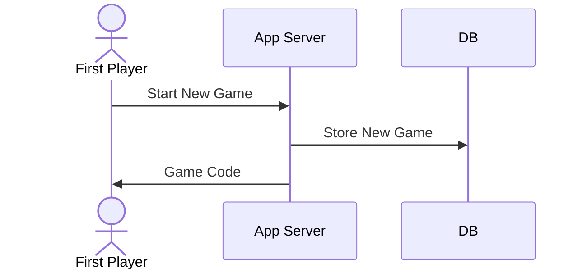
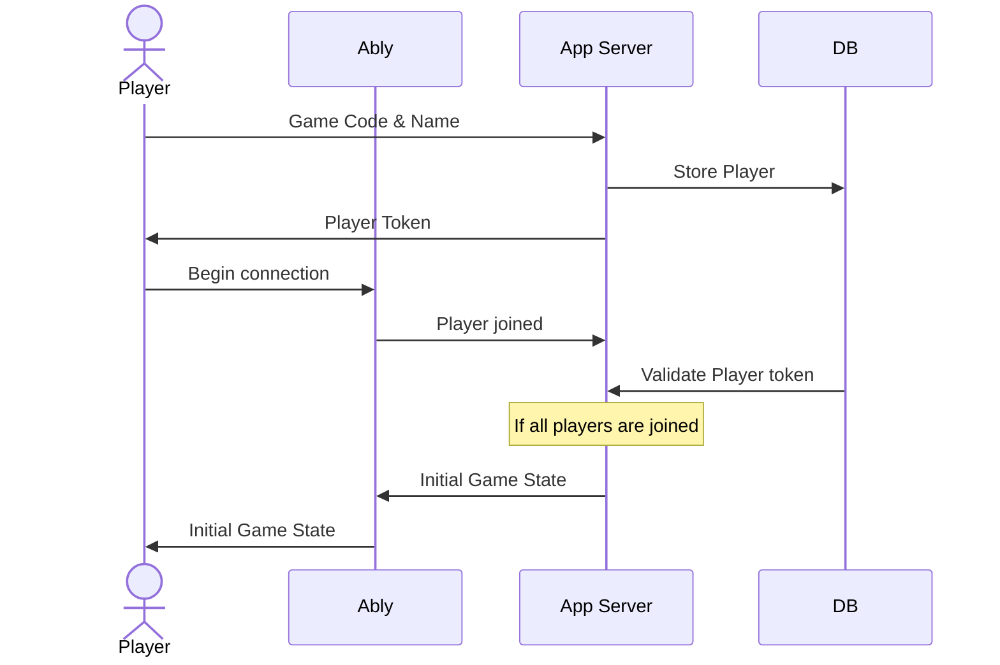
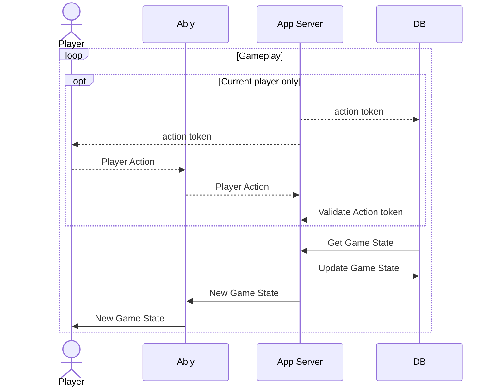

# Euchre 4 All Data Flow

## Start New Game

```mermaid
sequenceDiagram
actor First Player
participant App Server
participant DB
First Player->>App Server: Start New Game
App Server->>DB: Store New Game
App Server->>First Player: Game Code
```

## Join Game

```mermaid
sequenceDiagram
actor Player
participant Ably
participant App Server
participant DB
Player->>App Server: Game Code & Name
App Server->>DB: Store Player
App Server->>Player: Player Token
Player->>Ably: Begin connection
Ably->>App Server: Player joined
DB->>App Server: Validate Player token
Note over App Server: If all players are joined
App Server->>Ably: Initial Game State
Ably->>Player: Initial Game State
```

## Gameplay

```mermaid
sequenceDiagram
actor Player
participant Ably
participant App Server
participant DB
loop Gameplay
	opt Current player only
		App Server-->>DB: action token
		App Server-->>Player: action token
		Player-->>Ably: Player Action
		Ably-->>App Server: Player Action
		DB-->>App Server: Validate Action token
	end
	DB->>App Server: Get Game State
	App Server->>DB: Update Game State
	App Server->>Ably: New Game State
	Ably->>Player: New Game State
end
```
