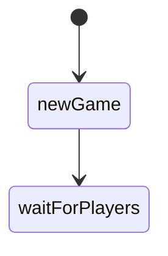
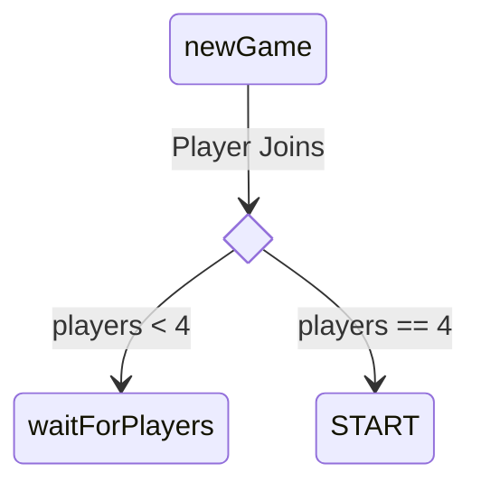
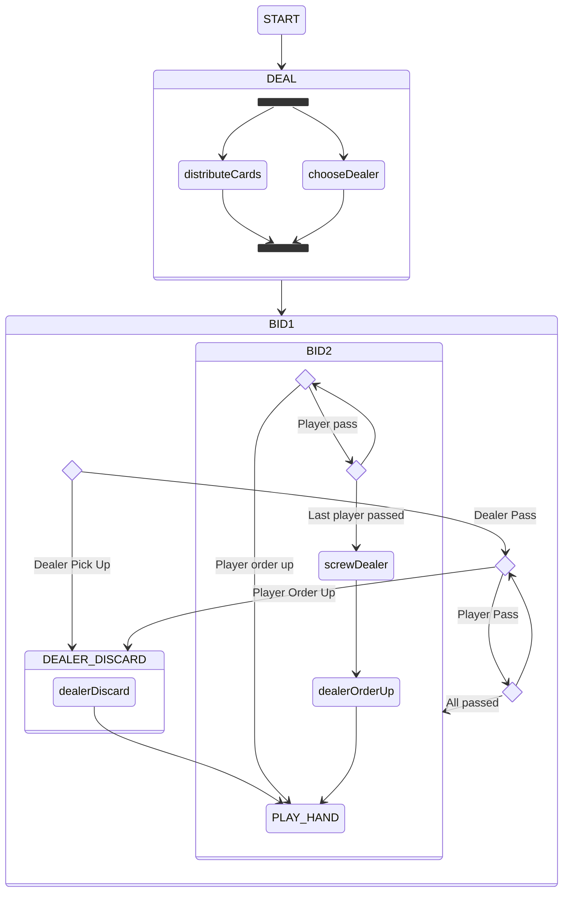

# Euchre 4 All State Diagrams

## New Game



## Player Joins



## Gameplay



## Start Game

```mermaid
stateDiagram
	state pickOrPass_dealer <<choice>>
	state pickOrPass_player <<choice>>
	state allPassed <<choice>>
	startGame --> startHand
	startHand --> dealCards
	dealCards --> bidRound1
	dealCards --> chooseDealer
	chooseDealer --> pickOrPass_dealer
	pickOrPass_dealer --> exchangeUpcard: Dealer Pick Up
	pickOrPass_dealer --> pickOrPass_player: Dealer Pass
	pickOrPass_player --> allPassed: Player Pass
	allPassed --> pickOrPass_player
	allPassed --> 
	pickOrPass_player --> exchangeUpcard: Player Pick Up
	exchangeUpcard --> playHand
	playHand --> pickPlayer
```

## Deal

```mermaid
stateDiagram
	

```

## Bid Round 1

```mermaid
stateDiagram

```

## Bid Round 2

```mermaid
stateDiagram

```

## Dealer Discard

```mermaid
stateDiagram

```

## Play Hand

```mermaid
stateDiagram

```

## Score Round

```mermaid
stateDiagram

```

## Score Hand

```mermaid
stateDiagram

```

## End

```mermaid
stateDiagram

```
